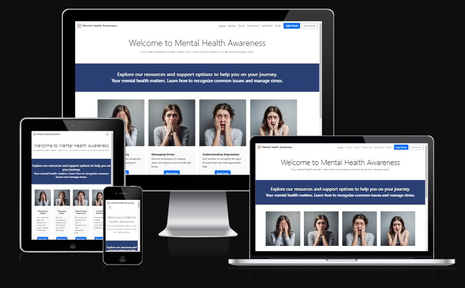
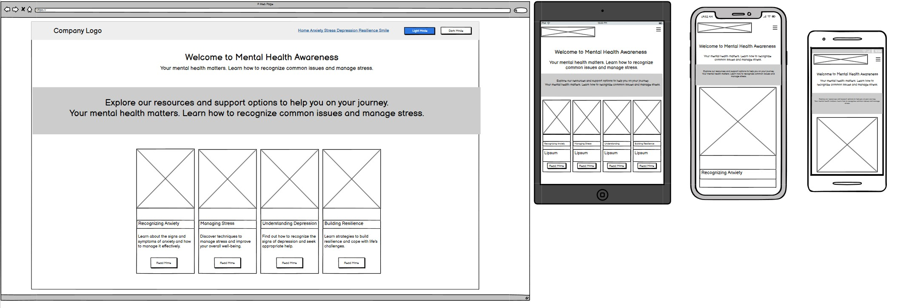
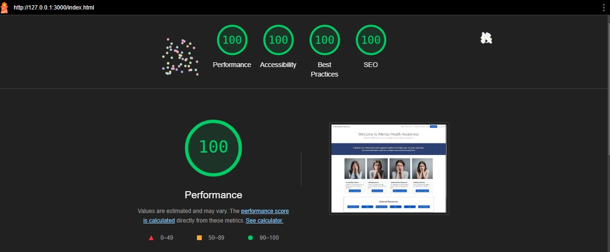
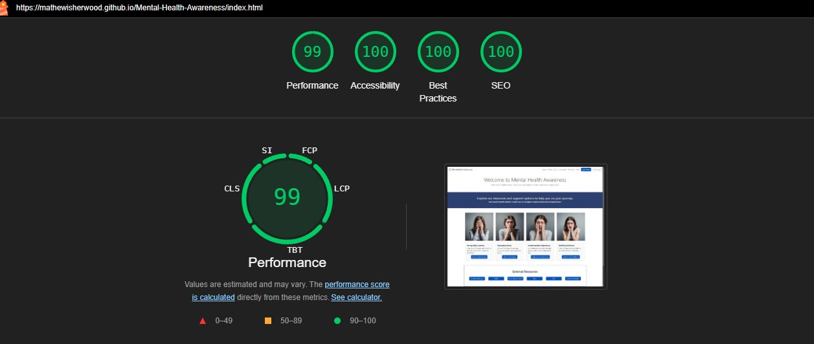

# Mental Health Awareness


## Contents
- [Project Overview](#project-overview)
- [Goals](#goals)
- [User Stories](#user-stories)
- [Wireframe](#wireframe)
- [Project Structure](#project-structure)
- [Pages](#pages)
- [Styles](#styles)
- [Images](#images)
- [Dependencies](#dependencies)
- [Features](#features)
- [AI Usage](#ai-usage)
- [How to Run / Deployment](#how-to-run--deployment)
- [Contributing](#contributing)
- [License](#license)
- [Validator Testing](#validator-testing)

## Project Overview
The Mental Health Awareness project aims to provide accessible, beginner-friendly information on mental health. The website helps users recognize common mental health issues and manage stress, presented in a supportive and organized layout. The site uses HTML and CSS with Bootstrap to create a calming and well-organized user experience.

[Project Link](https://mathewisherwood.github.io/Mental-Health-Awareness/)

[Back to Contents](#contents)

## Goals
- **External User’s Goal:** To seek accessible, beginner-friendly information on mental health, including how to recognize common issues and manage stress, presented in a supportive and organized layout.
- **Site Owner’s Goal:** To create a welcoming webpage that provides basic mental health information using a clean and supportive design.

[Back to Contents](#contents)

## User Stories
1) As a person experiencing stress at work, I want to find resources on effective stress management techniques, So that I can reduce my anxiety and improve my productivity without feeling overwhelmed.
2) As an individual struggling with depression, I want to access self-care tips, So that I can manage my mood and practice self-compassion in my daily routine. 
3) As someone with a busy lifestyle, I want to find quick stress-relief exercises or tools I can do in just a few minutes, So that I can feel better even on days when I don’t have much time to focus on my mental health.
4) As a caregiver to a loved one with depression, I want to access resources on how to support someone dealing with mental health challenges, So that I can provide compassionate and effective help without feeling overwhelmed myself.

[Back to Contents](#contents)

## Wireframe

[Back to Contents](#contents)

## Project Structure
```
Mental Health Awareness/ 
├── anxiety.html 
├── depression.html 
├── images/ 
│ └── Smiles/ 
│ ├── 14.jfif 
│ ├── 3.avif 
│ └── 8.avif 
├── index.html 
├── README.md 
├── resilience.html 
├── smile.html 
├── stress.html 
└── style.css 
```
[Back to Contents](#contents)

## Pages
- **index.html:** The main landing page for the Mental Health Awareness website.
- **anxiety.html:** Provides information about anxiety, its symptoms, and management techniques.
- **depression.html:** Offers insights into depression, its signs, and coping strategies.
- **resilience.html:** Discusses building resilience and maintaining mental well-being.
- **smile.html:** Focuses on the importance of smiling and positive thinking.
- **stress.html:** Covers stress management and relaxation techniques.

[Back to Contents](#contents)

## Styles
- **style.css:** Contains custom CSS styles for the website.

[Back to Contents](#contents)

## Images
- **images/Smiles/:** Contains images used in the smile.html page.

[Back to Contents](#contents)

## Dependencies
- **Bootstrap 5.3.3:** Used for responsive design and styling. Included via CDN.

[Back to Contents](#contents)

## Features
- Light / Dark Mode 
- Reactive Menu (Desktop) 
- Reactive Menu (Mobile) 

[Back to Contents](#contents)

## AI Usage
I used AI to assist in retagging of common code text and for the generation of the images on the front page. 

[Back to Contents](#contents)

## How to Run / Deployment
1. Clone the repository:
    ```sh
    git clone https://github.com/yourusername/Mental-Health-Awareness.git
    ```
2. Open `index.html` in your web browser to view the website.

[Back to Contents](#contents)

## Contributing
Contributions are welcome! Please fork the repository and create a pull request with your changes.

[Back to Contents](#contents)

## License
This project is licensed under the MIT License.

[Back to Contents](#contents)

## Testing
On both mobile and tablet the NavBar confines down into a dropdown toggle. Images and Videos are also sized to fit in relation to the screen sizes on different devices allowing the visuals to be clear on all screens.

[Back to Contents](#contents)

## Validator Testing
1. HTML
No errors were returned when passing through the official W3C validator
https://validator.w3.org/nu/?doc=https%3A%2F%2Fmathewisherwood.github.io%2FMental-Health-Awareness%2F

2. CSS
No errors were found when passing through the official (Jigsaw) validator
https://jigsaw.w3.org/css-validator/validator?uri=https%3A%2F%2Fmathewisherwood.github.io%2FMental-Health-Awareness%2F&profile=css3svg&usermedium=all&warning=1&vextwarning=&lang=en

3. Lighthouse.
No issues or errors reported on all pages
Potential further optimisations could be made to the smile page for additional performance points due to this page being a gallery style page and having many images. Lazyload reduced score for performance rather than increasing it.

Lighthouse score running on local test site

Lighthouse score whilst running live on Github

[Back to Contents](#contents)